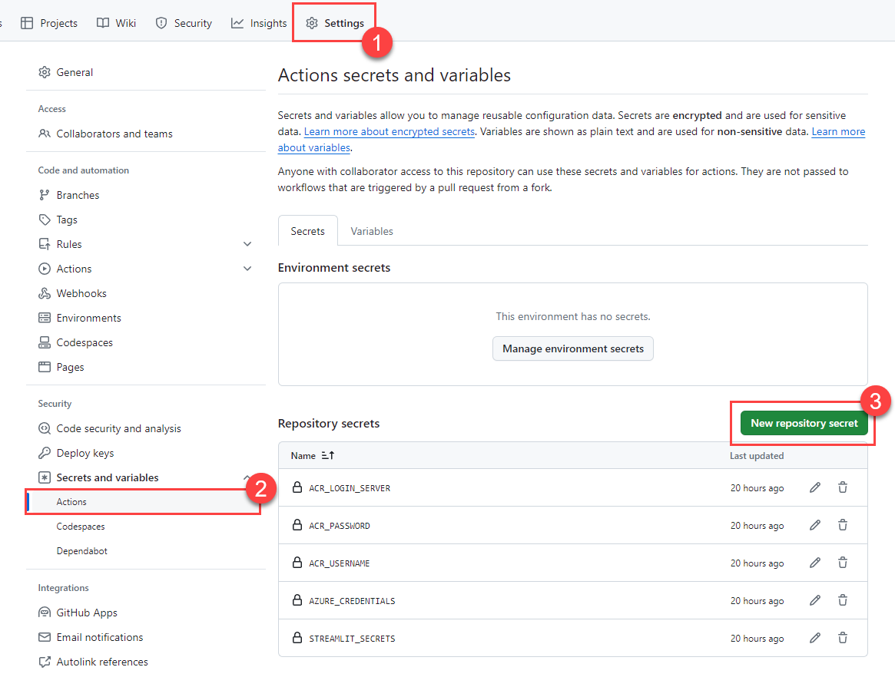

# Task 03 - Deploy to Azure App Services (20 minutes)

## Introduction

Running the API and dashboard locally are a good proof of concept, but the Contoso Suites team makes heavy use of Azure Application Services and would like to ensure that what you build locally will integrate well into their workflow. The Contoso Suites team uses GitHub for source control and GitHub Actions workflows for code deployment, and would like to ensure that this solution will not be overly disruptive of their current CI/CD process.

## Description

In this task, you will deploy the Contoso Suites API and dashboard to Azure Application Services. The Contoso Suites development team has provided you with Dockerfiles to containerize each application, as well as GitHub Actions workflows you will be able to use in your own repository.

The key tasks are as follows:

1. Copy the two workflows in `/src/.github/workflows/` into `.github/workflows`, and remove the `jekyll-gh-pages.yml` workflow.
2. Modify the `api.yml` and `dashboard.yml` workflow files in `.github/workflows`. Replace `{your_registry_name}` with the name of your Azure container registry and `{your_prefix}` with the unique identifier used to create your Azure resources.
3. Create a new service principal named `TechExcelAzurePaaS` using the following command in the az CLI, being sure to replace `{SUB_ID}` and `{RG}` with your subscription ID and resource group, respectively:

    ```cmd
    az ad sp create-for-rbac --name "TechExcelAzurePaaS" --json-auth --role contributor --scopes /subscriptions/{SUB_ID}/resourceGroups/{RG}
    ```

    Retain the JSON output to use in a GitHub Actions secret.
4. Create the following GitHub Actions secrets:
   1. `STREAMLIT_SECRETS` -- Paste in the entirety of your `secrets.toml` file. Be sure to change the value of `[api][endpoint]` from localhost to the URL of your API's App Service.
   2. `ACR_LOGIN_SERVER` -- Retrieve from your container registry's **Access keys** menu.
   3. `ACR_USERNAME` -- Retrieve from your container registry's **Access keys** menu.
   4. `ACR_PASSWORD` -- Retrieve from your container registry's **Access keys** menu.
   5. `AZURE_CREDENTIALS` -- Paste in the entirety of the JSON output from running `az ad sp create-for-rbac`.
5. Commit and push your repository changes.
6. Manually execute the GitHub Actions workflows named **API Deployment** and **Dashboard Deployment** if they do not run automatically.
7. Connect to your dashboard website and ensure that you can still perform chat with data operations. To test, you can use a question like, "Do I need to pay extra money to use an EV station when I am a guest of the hotel?"

    {: .note }
    > It may take several minutes for Azure Application Services to be ready to serve your dashboard website. If it does not come up within 5 minutes or so, you could choose to **Stop** and then **Start** the App Service.

## Success Criteria

- You have deployed your API and dashboard as Azure Application Services and are able to access the dashboard remotely.

## Learning Resources

- [Introduction to GitHub Actions](https://docs.github.com/en/free-pro-team@latest/actions/learn-github-actions/introduction-to-github-actions)
- [.NET Core Action to build and test](https://github.com/actions/starter-workflows/blob/dacfd0a22a5a696b74a41f0b49c98ff41ef88427/ci/dotnet-core.yml)
- [GitHub Actions for Azure](https://github.com/Azure/actions)
- [Environment variables](https://docs.github.com/en/free-pro-team@latest/actions/reference/workflow-syntax-for-github-actions#env)
- [Introduction to GitHub Actions](https://docs.github.com/en/free-pro-team@latest/actions/learn-github-actions/introduction-to-github-actions)
- [Authenticate with an Azure container registry](https://docs.microsoft.com/azure/container-registry/container-registry-authentication#admin-account)
- [GitHub Actions for Azure](https://github.com/Azure/actions)
- [Deploy a custom container to App Service using GitHub Actions](https://docs.microsoft.com/azure/app-service/deploy-container-github-action?tabs=service-principal#tabpanel_CeZOj-G++Q-3_service-principal)

## Solution

<details markdown="block">
<summary>Expand this section to view the solution</summary>

- In [the Azure portal](https://portal.azure.com), navigate to the resource group you have created and select the **Container registry** in the resource group.
- Navigate to the **Access keys** in the **Settings** menu and make note of your **Login server**, **Username**, and **password**. You will need these for GitHub Actions secrets. Also make note of the **Registry name** in order to modify the GitHub Actions workflows.
- After copying `api.yml` and `dashboard.yml` into the `.github/workflows` folder, replace any instances of `{your_registry_name}` with the registry name you copied in the prior step. Replace any instances of `{your_prefix}` with the unique identifier for your account. This is a 13-character string and is the first 13 characters of each Azure resource in your resource group.
- Create a new service principal named `TechExcelAzurePaaS` using the following command in the az CLI, being sure to replace `{YOUR SUBSCRIPTION ID}` and `{YOUR RESOURCE GROUP}` with the appropriate values:

  ```cmd
  az ad sp create-for-rbac --name "TechExcelAzurePaaS" --json-auth --role contributor --scopes /subscriptions/{YOUR SUBSCRIPTION ID}/resourceGroups/{YOUR   RESOURCE GROUP}
  ```

    Retain the JSON output to use in a GitHub Actions secret.
- To create a GitHub Actions secret, navigate to your forked GitHub repository and select the **Settings** menu. From there, navigate to **Secrets and variables** and select the **Actions** menu. You can then create new repository secrets.

    

    You will need to create a total of five such secrets:

    1. `STREAMLIT_SECRETS` -- Paste in the entirety of your `secrets.toml` file.
    2. `ACR_LOGIN_SERVER` -- Retrieve from your container registry's **Access keys** menu.
    3. `ACR_USERNAME` -- Retrieve from your container registry's **Access keys** menu.
    4. `ACR_PASSWORD` -- Retrieve from your container registry's **Access keys** menu.
    5. `AZURE_CREDENTIALS` -- Paste in the entirety of the JSON output from running `az ad sp create-for-rbac`.

- After committing and pushing your changes to the forked GitHub repository, navigate to the **Actions** menu. You will see two workflows, API Deployment and Dashboard Deployment. Select each in turn and select the **Run workflow** dropdown and choose **Run workflow** against your **main** branch.

    

    Each deployment may take several minutes to complete.
- To find the URL of your dashboard, navigate to your resource group in [the Azure portal](https://portal.azure.com). Then, select the **App service** whose name ends with **-dash**. You can obtain the URL from the **Default domain** entry in the Essentials section.

    

</details>
