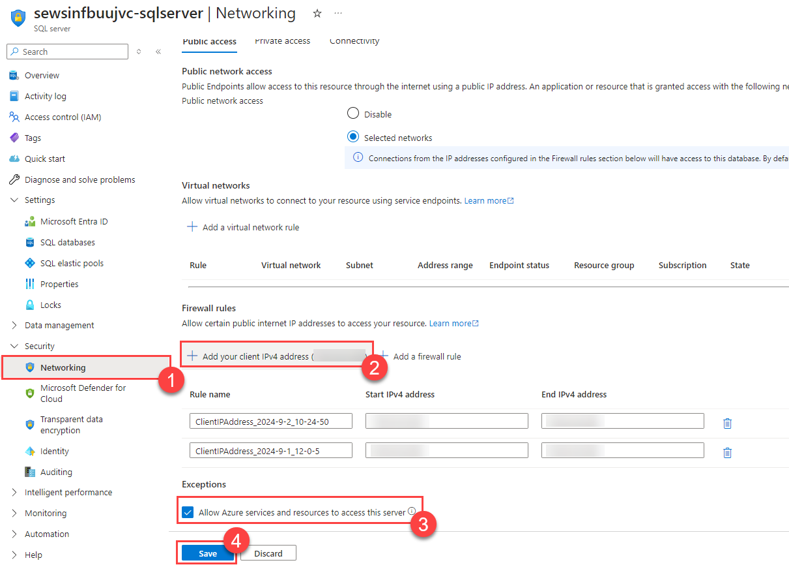
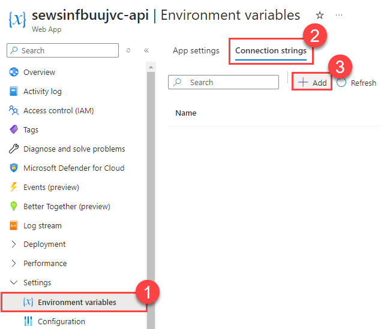

# Task 01 - Prepare an Azure SQL Database (20 minutes)

## Introduction

The Contoso Suites team is interested in learning how they can use Semantic Kernel to extend their application capabilities. The development team is currently responsible for creating any new API endpoints that end users will consume through front-end applications, but a common complaint is that the turnaround time for new API endpoint is too slow. The development team is interested in learning more about Semantic Kernel and whether it could be a viable solution for their problem.

Throughout the course of this exercise, you will complete a simple Web API to support database calls. Then, you will implement a Semantic Kernel plugin to enable arbitrary database query generation (of `SELECT` statements), and display the results as a table in the front-end application.

## Description

In this task, you will load data that Contoso Suites staff has provided to you into Azure SQL DB. This data contains a sample of customer, hotel, and bookings data from their SQL Server-based bookings system. From there, they would like you to implement a .NET Web API endpoint exposing this customer information. They have provided you with most of the code but did not have time to complete the task.

The key tasks are as follows:

1. Add your IP address to your Azure SQL Server's firewall allow list and also enable the **Allow Azure services and resources to access this server** setting.
2. Connect to your remote Azure SQL Database and run the script in `src/data/BookingsHistory.sql` against that database, creating several tables and populating them with sample data.
3. Create an environment variable locally called `AZURE_SQL_DB_CONNECTION_STRING`, containing the connection string for your Azure SQL DB. Use SQL authentication. By default, the user ID is `contosoadmin` and the database name is `ContosoSuitesBookings`. The password is whatever you set it to be in Exercise 1. Be sure to set the `Encrypt` and `TrustServerCertificate` settings to **True**.

    {: .note }
    > After creating an environment variable, you will need to close and re-open your terminal to refresh the list of environment variables. If you are using Visual Studio Code to run this code base, you may need to close and re-open all open instances of VS Code, as instantiating a new terminal might not refresh the list of environment variables.

4. Complete the function mappings in `src/ContosoSuitesWebAPI/Program.cs` for the `/Hotels/` endpoints. Each endpoint should call the relevant database service and return the results of the appropriate method.
5. Build and run the Web API service locally. Connect to the URL provided in the **"Now listening on:"** line and navigate to the `/Hotels` endpoint. For example, if your host is localhost and on port 5292, navigate to `http://localhost:5292/Hotels`. You should see a list of four hotels. Test the other two endpoints as well.
6. Open the Streamlit application and navigate to the **API Integration** page. You should see a drop-down list asking you to select a hotel, followed by a table of bookings for that hotel.

    {: .note }
    > You may need to change the `[api].[endpoint]` key in your `secrets.toml` file to point to your local Web API service, rather than the App Service deployment.

7. Deploy your App Service code changes and ensure they propagate to Azure App Services. Then, add a new connection string to the App Service's environment variables called `AZURE_SQL_DB_CONNECTION_STRING`. The Value should be the value of your connection string and the Type should be **SQLServer**.
8. Test your deployed Streamlit application and ensure that it is able to load the hotels drop-down list and bookings table as expected.

## Success Criteria

- You have created a series of tables in the ContosoSuitesBookings Azure SQL Database.
- You have updated the .NET Web API endpoint to allow querying against hotel and bookings data.

## Tips

- If your .NET application build is failing when you try to run `dotnet run` and you receive an error that the build cannot load the required packages from NuGet, you may be missing a link to the Microsoft NuGet repository. Run the command `dotnet nuget list source` and see if you have an entry enabled for nuget.org. If not, you can add it with the following command: `dotnet nuget add source https://api.nuget.org/v3/index.json -n nuget.org`. If you have one but it is currently disabled, you can enable it with the command `dotnet nuget enable source nuget.org`.

## Learning Resources

- [Azure SQL Database and Azure Synapse IP firewall rules](https://learn.microsoft.com/azure/azure-sql/database/firewall-configure?view=azuresql)
- [Environment variables and app settings in Azure App Service](https://learn.microsoft.com/azure/app-service/reference-app-settings?tabs=kudu%2Cdotnet)

## Solution

<details markdown="block">
<summary>Expand this section to view the solution</summary>

- To add your IP address to the Azure SQL Server's firewall allow list, first navigate to [the Azure portal](https://portal.azure.com). From there, find your resource group and select the **SQL server** service. In the **Security** menu on the left-hand side, choose the **Networking** option. Then, select the **Add your client IPv4 address** option in the **Firewall rules** heading. Select the **Allow Azure services and resources to access this server** checkbox and then select **Save** to save your changes.

    

- If you have a tool such as SQL Server Management Studio or Azure Data Studio already installed, you can connect to your Azure SQL Database via its endpoint--the server name in your SQL connection string. If you do not have a database tool installed, navigate to the **ContosoSuitesBookings** database in your resource group. Then, on the left-hand menu, select the **Query editor (preview)** menu option. Log in with your SQL user name (`contosoadmin` by default) and password. From there, you can paste the contents of `src/data/BookingsHistory.sql` to create the bookings history tables and load them with sample data.
- Create an environment variable locally, giving it the name `AZURE_SQL_DB_CONNECTION_STRING`. There are several ways to create an environment variable, including `setx` in the Windows command shell, the `$env` variable in PowerShell, and the **Environment Variables** option in the **Advanced** tab of System Properties.

    To perform this in PowerShell, you can run the following command:

    ```powershell
    $env:AZURE_SQL_DB_CONNECTION_STRING = 'Server=tcp:{your server}.database.windows.net,1433;Initial Catalog=ContosoSuitesBookings;Persist Security Info=False;User ID=contosoadmin;Password={your_password};MultipleActiveResultSets=False;Encrypt=True;TrustServerCertificate=False;Connection Timeout=30;'
    ```

    Should you wish to create an environment variable using the System Properties user interface, it is possible to do this as well.

    

    {: .note }
    > After creating an environment variable, you will need to close and re-open your terminal to refresh the list of environment variables. If you are using Visual Studio Code to run this code base, you may need to close and re-open all open instances of VS Code, as instantiating a new terminal might not refresh the list of environment variables.
- The completed code for the three Hotels endpoints in `Program.cs` are as follows:

    ```csharp
    app.MapGet("/Hotels", async () => 
    {
        var hotels = await app.Services.GetRequiredService<IDatabaseService>().GetHotels();
        return hotels;
    })
        .WithName("GetHotels")
        .WithOpenApi();
    
    app.MapGet("/Hotels/{hotelId}/Bookings/", async (int hotelId) => 
    {
        var bookings = await app.Services.GetRequiredService<IDatabaseService>().GetBookingsForHotel(hotelId);
        return bookings;
    })
        .WithName("GetBookingsForHotel")
        .WithOpenApi();
    
    app.MapGet("/Hotels/{hotelId}/Bookings/{min_date}", async (int hotelId, DateTime min_date) => 
    {
        var bookings = await app.Services.GetRequiredService<IDatabaseService>().GetBookingsByHotelAndMinimumDate(hotelId, min_date);
        return bookings;
    })
        .WithName("GetRecentBookingsForHotel")
        .WithOpenApi();
    ```

- In order to create an environment variable for your App Service, perform the following actions.
  - Navigate back to your resource group in the Azure Portal. Then, select the **App Service** named `{your_unique_id}-api`. In the **Settings** menu, choose the **Environment variables** option. Then, navigate to the **Connection strings** tab and select the **Add** button.

     

  - Enter `AZURE_SQL_DB_CONNECTION_STRING` as the Name and then fill in your connection string for Value. For Type, select **SQLServer** from the drop-down. Then, select the **Save** button to save this environment variable.

     

    After saving your changes, select the **Apply** button to finish saving the new connection string. This will restart your API service.

</details>
