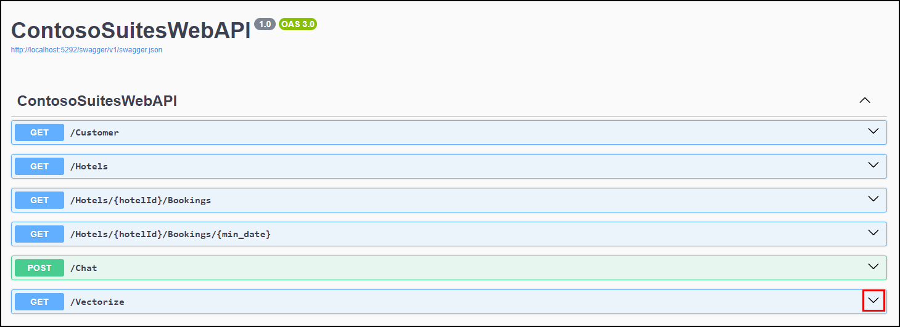
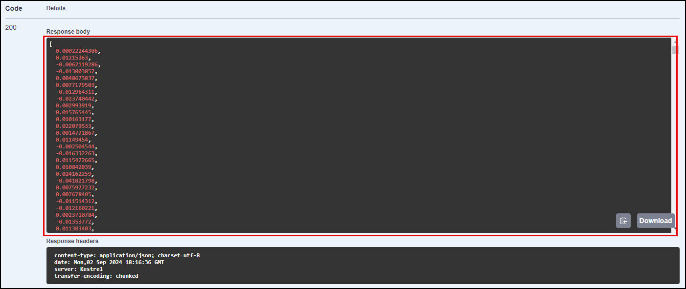

# Task 03 - Integrate vector search capabilities into the Contoso Suites CIS (30 minutes)

## Introduction

TODO: Add short intro.

## Description

In the previous task, you added vector embeddings to property maintenance request data stored in Azure Cosmos DB for NoSQL and then performed a vector search using query embeddings stored in a file. To perform vector searches, it is necessary to create embeddings for incoming query text, so in this task, you will integrate vector search capabilities into the Contoso Suites Customer Information System (CIS) application, leveraging a vectorization API endpoint in the Contoso Suites Web API to create embeddings for the query being performed. The API will be used to vectorize incoming questions from the UI, so they can be used in queries executing the `VectorDistance()` function.

The key tasks are as follows:

1. Generate query text embeddings using the `/Vectorize` endpoint of the ContosoSuitesWebAPI.
2. Add vector search to the UI, leveraging funtion calling.
3. Integrate...

## Success Criteria

- You have tested the `/Vectorize` endpoint of the ContosoSuitesWebAPI locally and used the generated vectors to execute similarity search queries in Azure Cosmos DB.
- You have successfully added the ability to perform vector searches to the UI.

## Tips

- If the ContosoSuitesWebAPI .NET application build is failing when you try to run `dotnet run` and you receive an error that the build cannot load the required packages from NuGet, you may be missing a link to the Microsoft NuGet repository. Run the command `dotnet nuget list source` and see if you have an entry enabled for nuget.org. If not, you can add it with the following command: `dotnet nuget add source https://api.nuget.org/v3/index.json -n nuget.org`. If you have one but it is currently disabled, you can enable it with the command `dotnet nuget enable source nuget.org`.

## Learning Resources

TODO...

## Solution

<details markdown="block">
<summary>Expland this section to view the solution</summary>

- The steps to generate vector embeddings for query text using the ContosoSuitesWebAPI's `/Vectorize` endpoint are as follows:
  - In Visual Studio Code, navigate to the `src\ContosoSuitesWebAPI` project in the explorer pane on the left-hand side, then locate and open the `appsettings.development.json` file.
  - In the `appsettings.development.json` file, update the settings to provide your Cosmos DB connection string and your Azure OpenAI endpoint and key. Note, the deployment name is preset, but if it differs in your environment, this will need to be set to the value you configured.
  - Save the `appsettings.development.json` file.
  - In Visual Studio Code, open a new terminal window and change the directory to `scr\ContotoSuitesWebAPI`.
  - At the terminal prompt, enter the following command to run the API locally:

    ```bash
    dotnet run
    ```

  - Once the API has started, as indicated by output in the terminal stating `Now listening on: http://localhost:5292`, open a web browser and navigate to the [Swagger UI page for the API](http://localhost:5292/swagger/)
  - On the Swagger UI page, expand the `/Vectorize` endpoint block.

    

  - Within the `/Vectorize` block, select **Try it out**.

    

  - Enter the query "rooms where the air conditioning is not working" into the **text** box, then select **Execute**.

    

  - Observe the **Response body** returned. The response contains an array of floating point values representing the query text. This array contains 1536 dimensions.
  - Copy the entire response body, include the opening and closing square brackets.

    

  - In the [Azure portal](https://portal.azure.com), navigate to your Cosmos DB resource and select **Data Explorer** in the left-hand menu.
  - In the Data Explorer, expand the **ContosoSuites** database and the **MaintenanceRequests** container, then select **Items**.
  - On the toolbar, select **New SQL Query**.
  - In the new query window, paste in the following query:

    ```sql
    SELECT c.hotel, c.details, VectorDistance(c.request_vector, <QUERY_VECTOR>) AS SimilarityScore
    FROM c
    ```

  - Replace the `<QUERY_VECTOR>` token in the query with the vector output you copied from the API response body.
  - Select **Execute Query** on the toolbar and observe the output in the **Results** panel.

- TODO: Add note to ensure the web api is still running locally for testing...

- Open the file `src\ContosoSuitesDashboard\pages\3_Vector_Search.py`. The code will run as-is, but will not have knowledge of how to perform vector searches. The support vector search capabilities, make the following changes to the Python script.
  - Add...
  - Change the ... 
  - Test your code by opening a new terminal window in Visual Studio Code, navigating to the `src\ContosoSuitesDashboard` folder, then running the following command to start the Streamlit dashboard:

    ```python
    python -m streamlit run Index.py
    ```

- Navigate to the **Vector Search** page using the left-hand menu, and then submit each of the following queries for maintenance requests:
  - "Show me rooms where the air conditioning unit is malfunctioning"
  - TODO...
  - TODO...

</details>
