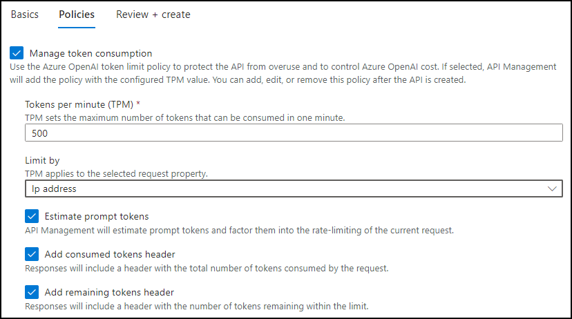
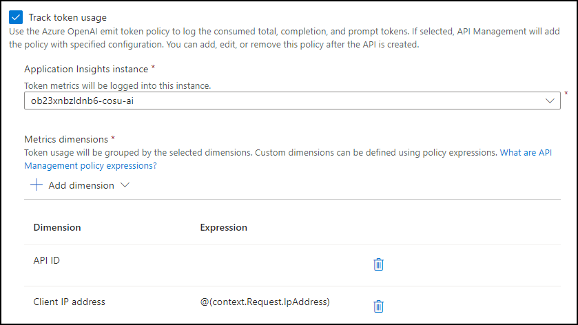
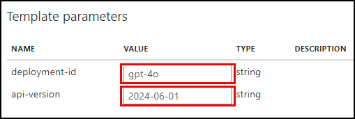
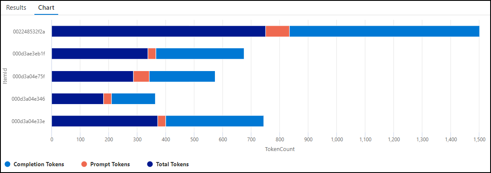

# Task 01 - Import an Azure OpenAI API and manage token consumption (20 minutes)

## Introduction

When developing GenAI applications, managing token consumption is crucial. The Azure OpenAI Service assigns a quota for your model deployments, expressed in tokens-per-minute (TPM), which is distributed across your model consumers. In the prototype you are building for Consoto Suites, you would like to be able to track token consumption by client IP address and ensure a single client cannot consume the entire TPM quota, leaving other clients with no option to take advantage of GenAI functionality.

## Description

In this task, you will import your Azure OpenAI service as an API in Azure API Management (APIM), implement a token limit policy, and emit token usage metrics to manage token consumption effectively.

The key tasks are as follows:

1. Import your Azure OpenAI Service resource as an API in Azure API Management.
   - Assign a display name of "Azure OpenAI API" and a name of "azure-openai-api."
   - Include "/opanai" at the end of the API URL, to improve SDK compatibility.
2. Define a token limit policy to protect the API from overuse and to control Azure OpenAI costs.
   - Use a TPM value of 500 per client IP address.
   - Factor estimated prompt tokens into rate-limiting.
   - Add consumed and remaining token headers to API responses.
3. Track token usage with an emit policy to log the consumed total, completion, and prompt tokens.
   - Include custom dimensions of "API ID" and "Client IP address."
4. Test the API and review the impact of the assigned policies.
   - Call the chat completions API endpoint and inspect the headers and "usage" property in the response body.
     - In the headers, locate and review the values assigned to the **consumed-tokens** and **remaining-tokens** headers added by your token limiting policy.
     - In the response body JSON, locate and review the "usage" element appended to the response.
   - Navigate to the Application Insights instance associated with your APIM service and use Kusto queries against the `customMetrics` table to analyze token usage per request.

## Success Criteria

- You have imported your Azure OpenAI service resource as an API in Azure API Management.
- You have created a policy in APIM that limits token consumption to 500 TPM per client IP address and outputs token usage values in API response headers.
- You are emitting token usage metrics to log the consumed total, completion, and prompt tokens using a policy defined in APIM.
- You have tested the API and policies within the Azure API Management service's APIs page in the [Azure portal](https://portal.azure.com/) and can view token metrics in your Application Insights instance.

## Learning Resources

- [Overview of generative AI gateway capabilities in Azure API Management](https://learn.microsoft.com/azure/api-management/genai-gateway-capabilities)
- [Import an Azure OpenAI API](https://learn.microsoft.com/azure/api-management/azure-openai-api-from-specification)
- [Policies in Azure API Management](https://learn.microsoft.com/azure/api-management/api-management-howto-policies)
- [How to set or edit Azure API Management policies](https://learn.microsoft.com/azure/api-management/set-edit-policies?tabs=form)
- [Limit Azure OpenAI API token usage](https://learn.microsoft.com/azure/api-management/azure-openai-token-limit-policy)
- [Emit metrics for consumption of Azure OpenAI tokens](https://learn.microsoft.com/azure/api-management/azure-openai-emit-token-metric-policy)

## Solution

<details markdown="block">
<summary>Expand this section to view the solution</summary>

- To import your Azure OpenAI service resource as an API in Azure API Management and define token limit and emit policies:
  - Open a web browser and navigate to your Azure API Management resource in the [Azure portal](https://portal.azure.com/).
  - Expand the APIs menu on the API Management service page and select **APIs**.
  - On the **APIs** page, select **Add API** and select **Azure OpenAI Service** under **Create from Azure resource**.

    

  - On the **Create from Azure OpenAI service** **Basics** tab, set the following values:
    - **Azure OpenAI instance**: Choose the Azure OpenAI service resource you are using for this exercise.
    - **Azure OpenAI API version**: Accept the default value, which is the latest production-ready version.
    - **Display name**: Enter "Azure OpenAI API."
    - **Name**: This value with be automatically populated with "azure-openai-api," based on the display name you entered. You can edit this, but you should accept the generated value for this exercise.
    - **Description**: This is optional, so you can leave it blank or enter a description, such as "Azure OpenAI API."
    - **Base URL**: This will be automatically created based on the **Name** of your API. Accept the generated value.
    - **Improve SDK compatibility**: Check this box. It will result in "/openai" being added to the end of the **Base URL** value.
    - **Products**: Leave this empty.
  - Select **Next: Policies** and on the **Policies** tab, define the token limit and emitting policies.
  - To create a token limit policy, check the **Manage token consumption** box and set the following:
    - Enter a token limit of 500 tokens per minute (TPM).
    - Limit tokens by "IP address."
    - Check the box to include estimated prompt tokens.
    - Check the boxes to include the headers for the consumed and remaining tokens.

        

  - To use the Azure OpenAI emit token policy to log the consumed total, completion, and prompt tokens, check the **Track token usage** box and configure the following:
    - Choose the Application Insights instance associated with the resource group you are using for this exercise.
    - Add metric dimensions for **API ID** and **Client IP address**.

        

  - Select **Review + create**, then select **Create**.
  - The finished policies should look like the following in the policy editor:

    ```xml
    <policies>
        <inbound>
            <set-backend-service id="apim-generated-policy" backend-id="azure-openai-api-openai-endpoint" />
            <azure-openai-token-limit tokens-per-minute="500" counter-key="@(context.Request.IpAddress)" estimate-prompt-tokens="true" tokens-consumed-header-name="consumed-tokens" remaining-tokens-header-name="remaining-tokens" />
            <azure-openai-emit-token-metric>
                <dimension name="API ID" />
                <dimension name="Client IP address" value="@(context.Request.IpAddress)" />
            </azure-openai-emit-token-metric>
            <authentication-managed-identity resource="https://cognitiveservices.azure.com/" />
            <base />
        </inbound>
    </policies>
    ```

- To test the API, select **Azure OpenAI API** from the list of APIs on your API Management service's APIs page.
  - Select the **Test** tab, then select the **Creates a completion for the chat message** endpoint.
  - On the **Creates a completion for the chat message** page, enter the following under **Template parameters**:
    - **deployment-id**: Enter "gpt-4o"
    - **api-version**: Enter "2024-06-01"

        

  - Scroll down to the **Request body** section, ensure **Raw** is selected, and paste the following into the text box.

    ```json
    {
        "messages":[
            {"role": "system", "content": "You are a sarcastic unhelpful assistant."},
            {"role": "user", "content": "Tell me a story about AI."}
        ]
    }
    ```

    

  - Select **Send** at the bottom of the page.
  - Scroll to the page's **HTTP response** section and review the output on the **Message** tab.
    - In the headers, locate and review the **consumed-tokens** and **remaining-tokens** headers added by your token limiting policy.
    - In the response body JSON, locate the "usage" element appended to the response. This element provides token usage data to help you monitor and manage your Azure OpenAI API consumption. It includes the number of tokens used for the completion and prompt and the total token consumption.

        ```json
        "usage": {
            "completion_tokens": 161,
            "prompt_tokens": 28,
            "total_tokens": 189
        }
        ```

  - Next, select **Send** several times rapidly until you see an HTTP response containing a **429 Too Many Requests** status code.

    The response header will look similar to the following:

    ```http
    HTTP/1.1 429 Too Many Requests
    content-length: 85
    content-type: application/json
    date: Tue, 17 Sep 2024 00:05:47 GMT
    remaining-tokens: 0
    request-context: appId=cid-v1:28064454-b368-42b8-a293-4e597441f43f
    retry-after: 55
    vary: Origin
    ```

    The response body will contain the following:

    ```json
    {
        "statusCode": 429,
        "message": "Token limit is exceeded. Try again in 55 seconds."
    }
    ```

- To view the output of your token emitting policy, you will use Application Insights.
  - From your API Management service in the [Azure portal](https://portal.azure.com/), expand the **Monitoring** menu and select **Application Insights**, then select your Application Insights instance from the list.
  - On the Application Insights page, expand the **Monitoring** menu and select **Logs**.
  - On the **Logs** page, execute the following Kusto query to look for records in the `customMetrics` table:

    ```kusto
    customMetrics
    | where timestamp > ago(1h)
    | extend
        ItemId = substring(itemId, 24),
        ApiId = tostring(customDimensions['API ID']),
        ClientIpAddress = tostring(customDimensions['Client IP address'])
    | summarize
        CompletionTokens = sumif(value, name == 'Completion Tokens'),
        PromptTokens = sumif(value, name == 'Prompt Tokens'),
        TotalTokens = sumif(value, name == 'Total Tokens')
        by ItemId, ApiId, ClientIpAddress
    ```

    

  - You can also visualize token consumption using a chart with the following Kusto query:

    ```kusto
    customMetrics
    | where timestamp > ago(4h)
    | extend ItemId = substring(itemId, 24)
    | summarize TokenCount = sum(value) by ItemId, name
    | order by ItemId
    | render barchart with (kind=stacked)
    ```

    

</details>
